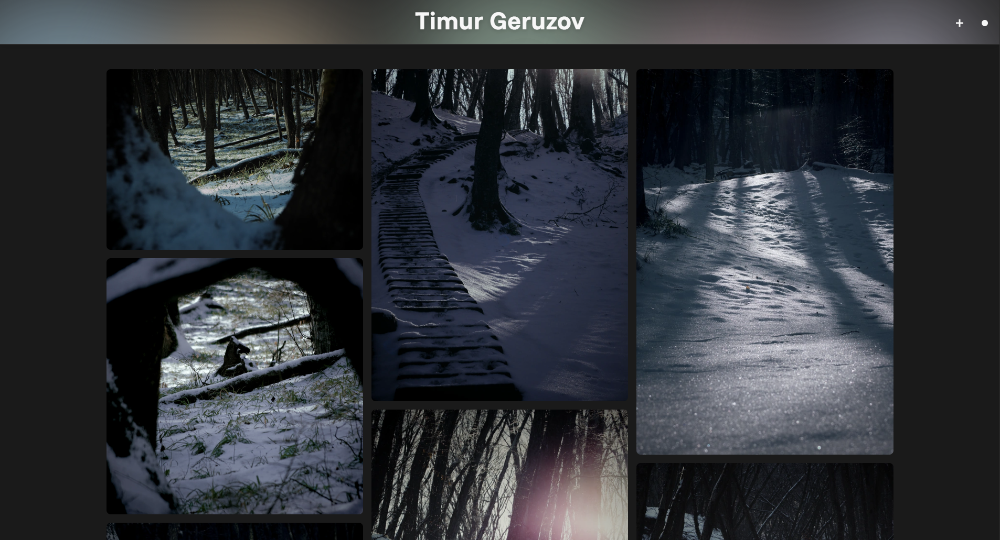
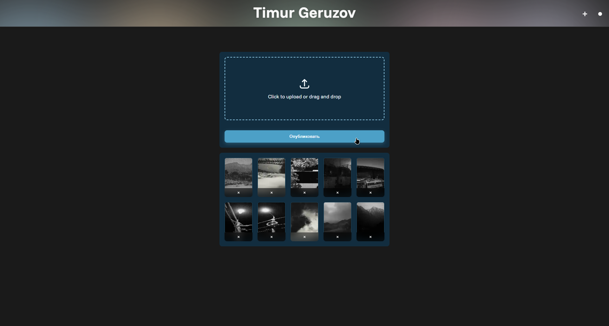

<h1 align="center">Django Photo Gallery for Timeweb Shared Hosting</h1>

<p align="center">
  This branch contains the shared-hosting adaptation of the project for Timeweb virtual hosting.
  <br />
  Apache + mod_wsgi, MySQL, no Docker, no Celery, no Redis, no long-running background workers.
</p>

<p align="center">
  <a href="https://tgeruzov.ru/"><strong>Live example</strong></a>
  ·
  <a href="https://github.com/tgeruzov/django-photo-gallery/blob/main/README.md">Main README</a>
  ·
  <a href="https://github.com/tgeruzov/django-photo-gallery/blob/main/README.ru.md">Main README (RU)</a>
  ·
  <a href="docs/timeweb-deploy.md">Full Timeweb Guide</a>
</p>

<p align="center">
  
  
  
</p>

## What This Branch Is For

Use `deploy/timeweb-shared` if your target is **Timeweb shared hosting**, not a VPS.

This branch exists to make the project fit the real constraints of shared hosting:

- Apache + `mod_wsgi`
- no Docker
- no Celery / Redis
- no `systemd`
- no custom Nginx
- limited server access
- MySQL-first configuration
- cron only through the hosting panel

If you want the general product overview, development workflow, and repo-wide documentation, use the main branch README instead:

- [Main README](https://github.com/tgeruzov/django-photo-gallery/blob/main/README.md)
- [Main README (RU)](https://github.com/tgeruzov/django-photo-gallery/blob/main/README.ru.md)

## What Is Included Here

This branch adds the files needed for Timeweb shared hosting:

- [`config/settings_shared.py`](config/settings_shared.py)
- [`.env.shared.example`](.env.shared.example)
- [`wsgi.py`](wsgi.py)
- [`.htaccess`](.htaccess)
- [`requirements-shared.txt`](requirements-shared.txt)
- [`docs/timeweb-deploy.md`](docs/timeweb-deploy.md)
- [`gallery/management/commands/process_photo_derivatives.py`](gallery/management/commands/process_photo_derivatives.py)

## Shared-Hosting Behavior

Compared with a VPS-oriented deployment, this branch changes runtime behavior on purpose:

- image derivative generation runs inline inside the web request
- background processing is optional and only suitable for small cron batches
- static and media are expected to be served by Apache
- the configuration is prepared for MySQL on shared hosting
- heavy platform-specific tooling is removed from the deployment path

## Quick Start on Timeweb

1. Upload this branch into `public_html/`.
2. Create a virtual environment one level above `public_html/`.
3. Install shared-safe dependencies:

```bash
cd ~/site
python3 -m venv venv
. venv/bin/activate
pip install --upgrade pip
pip install -r public_html/requirements-shared.txt
```

4. Create `.env` from `.env.shared.example` and fill in:

- `SECRET_KEY`
- `ALLOWED_HOSTS`
- `CSRF_TRUSTED_ORIGINS`
- `DB_NAME`
- `DB_USER`
- `DB_PASSWORD`
- `DB_HOST`
- `DB_PORT`

5. Run the release commands:

```bash
cd ~/site/public_html
export DJANGO_ENV=shared
python manage.py migrate --settings=config.settings_shared
python manage.py collectstatic --noinput --settings=config.settings_shared
python manage.py check --deploy --settings=config.settings_shared
```

6. Point the domain to the site, enable SSL in Timeweb, then verify:

- `/`
- `/health/`
- `/admin/`
- image upload
- static files
- media files

## Recommended Timeweb Reading Order

If you are deploying this branch for real, read these files in this order:

1. [`docs/timeweb-deploy.md`](docs/timeweb-deploy.md)
2. [`.env.shared.example`](.env.shared.example)
3. [`config/settings_shared.py`](config/settings_shared.py)
4. [`wsgi.py`](wsgi.py)
5. [`.htaccess`](.htaccess)

## What Not To Use on Shared Hosting

These parts of the repo can stay in version control, but they are not part of the Timeweb shared-hosting path:

- `Dockerfile`
- `docker-compose.yml`
- `docker-compose.prod.yml`
- Redis-backed Celery workers
- VPS-only service files and reverse-proxy configs

## Live Example

The Timeweb-adapted version is running here:

- [https://tgeruzov.ru/](https://tgeruzov.ru/)

## Need The Full Deployment Walkthrough?

Use the dedicated guide:

- [docs/timeweb-deploy.md](docs/timeweb-deploy.md)
