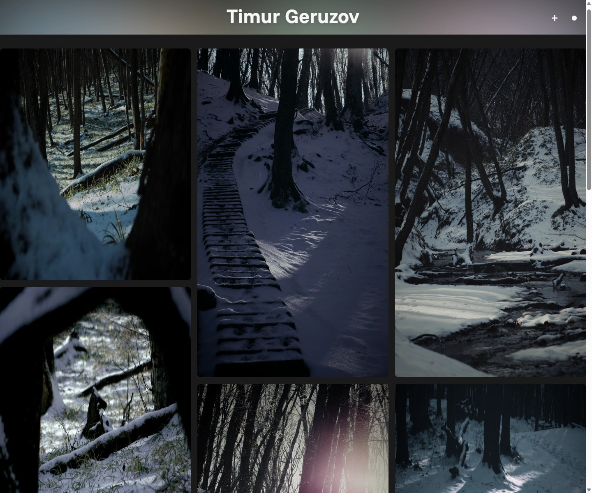
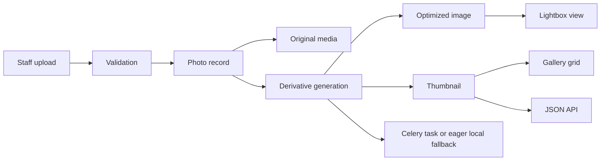

<h1 align="center">Django Photo Gallery</h1>

<p align="center">
  A personal photo gallery that feels like a viewing space first and an admin panel second.
  <br />
  Fast browsing, fullscreen viewing, optimized image delivery, and a Django backend that is ready to grow up.
</p>

<p align="center">
  <a href="https://github.com/tgeruzov/django-photo-gallery/actions/workflows/ci.yml">
    
  </a>
  <a href="https://www.python.org/downloads/release/python-3110/">
    
  </a>
  <a href="https://www.djangoproject.com/">
    
  </a>
  <a href="https://www.postgresql.org/">
    
  </a>
  <a href="LICENSE">
    
  </a>
</p>

<p align="center">
  <a href="#through-the-lens">Through the Lens</a>
  ·
  <a href="#darkroom-pipeline">Darkroom Pipeline</a>
  ·
  <a href="#choose-your-setup">Choose Your Setup</a>
  ·
  <a href="#field-notes">Field Notes</a>
  ·
  <a href="#community">Community</a>
</p>

<p align="center">
  
</p>

## Through the Lens

This project is built around the act of looking at photos.

- Visitors get a dense, scrollable gallery with fullscreen viewing and mobile-friendly navigation.
- Staff users get a focused upload flow instead of a cluttered content system.
- The backend generates optimized versions and thumbnails so the gallery feels fast without manual asset prep.
- The repo itself is set up for long-term maintenance: split settings, Docker workflows, CI, linting, and Celery-ready background processing.

<table>
  <tr>
    <td width="33%">
      <strong>For viewers</strong>
      <br />
      Infinite scroll, stable image grid, fullscreen lightbox, keyboard navigation, mobile swipe support.
    </td>
    <td width="33%">
      <strong>For maintainers</strong>
      <br />
      Split Django settings, production-like Docker profile, Celery worker path, shared media/static volumes.
    </td>
    <td width="33%">
      <strong>For contributors</strong>
      <br />
      Pre-commit, Ruff, Black, GitHub Actions, tests for upload flow, image derivatives, and API behavior.
    </td>
  </tr>
</table>

## Darkroom Pipeline



The same photo moves through a small but deliberate pipeline:

1. A staff user uploads one or more files.
2. The app validates format and size, then stores the source image.
3. Optimized and thumbnail variants are generated.
4. The gallery grid uses lighter assets, while fullscreen viewing uses the larger optimized version.
5. In development this can run eagerly, and in production-like mode it can be handed off to Celery.

## What Makes It Feel Different

### Browsing is the product

This is not a generic CMS with images attached. The viewing experience is the main feature, so the grid, lazy loading, lightbox, and progressive loading behavior matter as much as the admin flow.

### The image pipeline is part of the app

Instead of expecting someone to manually prepare assets, the project creates the versions it needs and can backfill missing derivatives later.

### The repo is ready for the next step

The project still feels like a personal gallery, but it now has the structure needed for safer iteration: separate settings, quality gates, a documented production path, and background-task support.

## Choose Your Setup

### Fastest start: Docker

```bash
# Linux / macOS
cp .env.example .env

# Windows PowerShell
Copy-Item .env.example .env

docker compose up --build
```

Open [http://localhost:8000](http://localhost:8000)

### Local Python setup

```bash
python -m venv .venv
```

```bash
# Windows
.venv\Scripts\activate

# Linux / macOS
source .venv/bin/activate
```

```bash
pip install -r requirements.txt
python manage.py migrate
python manage.py createsuperuser
python manage.py runserver
```

### Production-like rehearsal

```bash
docker compose -f docker-compose.prod.yml up --build
```

That profile runs:

- Django in `prod` mode
- Gunicorn as the app server
- Redis for Celery broker/result backend
- A dedicated Celery worker
- PostgreSQL for persistence
- Shared named volumes for `media/` and `staticfiles/`

For localhost smoke tests this profile keeps `SECURE_SSL_REDIRECT=0`, so it stays reachable over plain HTTP. Behind a real HTTPS proxy, turn that back on.

## Control Panel

| Route | Purpose |
| --- | --- |
| `/` | Main gallery page with AJAX pagination |
| `/upload/` | Staff-only multi-file upload page |
| `/all_photos.json` | Paginated gallery API |
| `/admin/` | Django admin |

### Example API response

```json
{
  "photos": [
    {
      "id": 1,
      "url": "/media/thumbnails/2026/02/25/image.webp",
      "full_url": "/media/optimized/2026/02/25/image.webp",
      "title": "My photo"
    }
  ],
  "page": 1,
  "page_size": 100,
  "has_next": true,
  "total": 240
}
```

## Field Notes

<details open>
<summary><strong>Key environment variables</strong></summary>

- Core app: `DJANGO_ENV`, `DEBUG`, `SECRET_KEY`, `ALLOWED_HOSTS`, `CSRF_TRUSTED_ORIGINS`, `TIME_ZONE`
- Database: `DB_NAME`, `DB_USER`, `DB_PASSWORD`, `DB_HOST`, `DB_PORT`, `DB_CONN_MAX_AGE`
- Image pipeline: `MAX_UPLOAD_SIZE_MB`, `MAX_IMAGE_PIXELS`, `MAX_JSON_PAGE_SIZE`, `DELETE_ORIGINAL_AFTER_OPTIMIZE`
- Background work: `ENABLE_BACKGROUND_TASKS`, `CELERY_TASK_ALWAYS_EAGER`, `CELERY_BROKER_URL`, `CELERY_RESULT_BACKEND`
- Production security: `SECURE_SSL_REDIRECT`, `SECURE_HSTS_SECONDS`
- Logging: `LOG_LEVEL`

</details>

<details>
<summary><strong>Quality gates</strong></summary>

```bash
pip install -r requirements-dev.txt
pre-commit install
pre-commit run --all-files
python manage.py check
python manage.py test
```

GitHub Actions also runs linting, migrations, and tests on `push` and `pull_request`.

</details>

<details>
<summary><strong>Repository map</strong></summary>

```text
django-photo-gallery/
├── config/                  # Django config, split settings, Celery wiring
├── docs/                    # README assets
├── gallery/                 # Models, views, services, forms, tests
├── static/                  # CSS, JS, icons
├── .github/workflows/       # CI pipeline
├── docker-compose.yml
├── docker-compose.prod.yml
├── pyproject.toml
├── .pre-commit-config.yaml
├── requirements.txt
├── requirements-dev.txt
└── manage.py
```

</details>

## Production Checklist

- Set `DJANGO_ENV=prod`
- Set `DEBUG=0`
- Use a strong random `SECRET_KEY`
- Configure strict `ALLOWED_HOSTS`
- Configure `CSRF_TRUSTED_ORIGINS`
- Run `python manage.py collectstatic --noinput`
- Run Redis and a Celery worker
- Keep `media/` backed up
- Enable HTTPS redirects in real production

## Community

- [Contributing Guide](CONTRIBUTING.md)
- [Security Policy](SECURITY.md)
- [Code of Conduct](CODE_OF_CONDUCT.md)

## License

Released under the MIT License. See [LICENSE](LICENSE).
