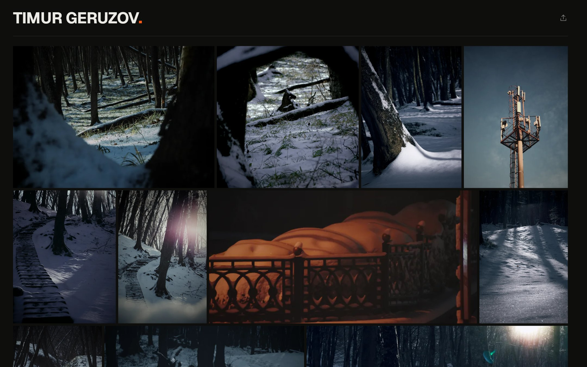
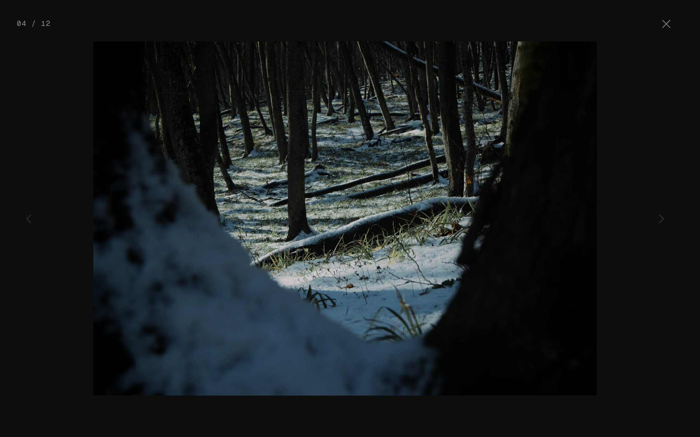
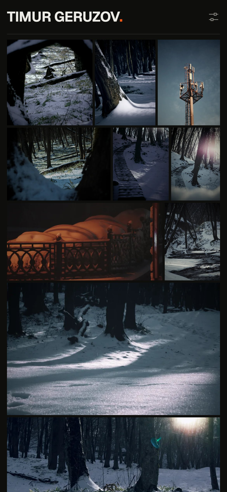
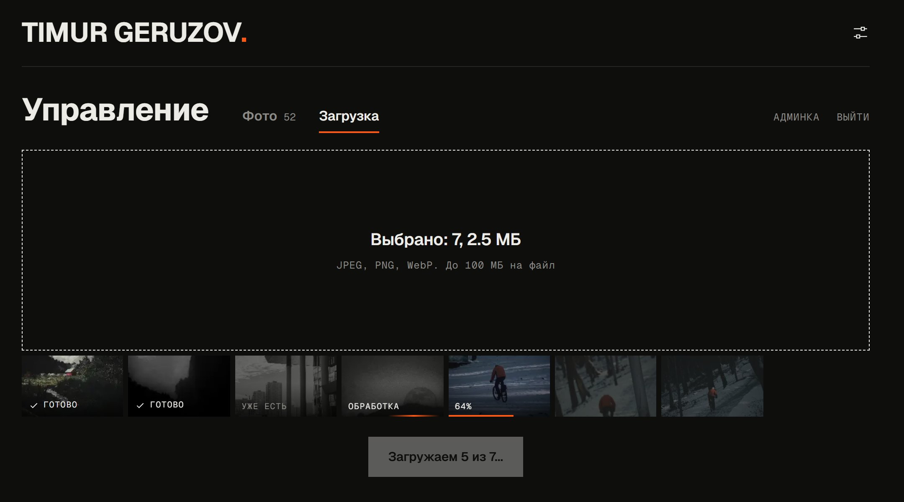

<div align="center">

# Django Photo Gallery

**Персональная фотогалерея на Django**


[](./LICENSE)

</div>

Я сделал эту галерею для своих фотографий: без ленты соцсетей, рекламы и чужого оформления. Снимки идут сплошной сеткой ровными строками, открываются на весь экран, а интерфейс вокруг них держится тихо и не спорит с фото. Всё, что нужно для работы, - Docker: одна команда поднимает базу и сайт.

<p align="center">
  
</p>

Сетка раскладывает фото строками одной высоты, слева направо в порядке загрузки. Новые снимки подгружаются по 12 штук при прокрутке, и уже показанные фото при этом не сдвигаются: меняется только последняя строка. На телефоне в строке по два снимка.

---

## Запуск

Нужен установленный [Docker](https://www.docker.com/products/docker-desktop/) с Docker Compose.

```bash
git clone https://github.com/tgeruzov/django-photo-gallery.git
cd django-photo-gallery
docker compose up --build
```

Галерея откроется на [localhost:8000](http://localhost:8000). При первом запуске Docker соберёт образ, поднимет PostgreSQL, применит миграции и создаст локального администратора: логин и пароль лежат в `docker-compose.yml`, в переменных `DJANGO_SUPERUSER_USERNAME` и `DJANGO_SUPERUSER_PASSWORD`. Войдите на [localhost:8000/admin](http://localhost:8000/admin), и в шапке галереи появится иконка загрузки.

Код подключён в контейнер напрямую, поэтому правки подхватываются без пересборки. Загруженные фото лежат в папке `media/` рядом с кодом, база - в томе Docker `postgres_data`, они переживают перезапуск. Остановить: <kbd>Ctrl</kbd>+<kbd>C</kbd> или `docker compose down`.

> [!WARNING]
> `docker-compose.yml` рассчитан только на локальный запуск: там включён режим отладки и простой пароль администратора. Как запускать галерею на сервере - в разделе [Деплой](#деплой).

---

## Как пользоваться

### Просмотр
Клик по фото открывает его на весь экран: снимок вырастает из своей карточки, а при закрытии возвращается в неё. Сначала показывается миниатюра, полная версия подменяет её, как только загрузится, а соседние снимки подгружаются заранее, поэтому листание идёт без задержек. Когда листание доходит до конца загруженных фото, галерея сама подгружает следующие.

Управление в просмотре едва заметно: счётчик в углу, крестик и стрелки вдоль краёв экрана, которые проступают при наведении. Через 2.5 секунды без движения мыши всё это гаснет вместе с курсором, и остаётся только фото.

| Действие | Мышь и клавиатура | Телефон |
|---|---|---|
| Следующее и предыдущее фото | клавиши со стрелками вправо и влево или стрелки у краёв экрана | свайп влево и вправо |
| Увеличить | двойной клик по фото | двойной тап или щипок |
| Подвинуть увеличенное фото | перетащить мышью | перетащить пальцем |
| Закрыть | <kbd>Esc</kbd>, крестик или клик по фону | свайп вниз |

<p align="center">
  
  &nbsp;&nbsp;
  
</p>

### Загрузка
Загружать фото может только администратор: иконка в шапке ведёт на страницу загрузки. Файлы можно выбрать или перетащить в рамку, подходят JPEG, PNG и WebP до 100 МБ каждый. Лишний файл убирается крестиком на его превью.

После `Опубликовать` файлы уходят по одному, и на каждом превью видно, что с ним происходит:
* `64%` и оранжевая полоска - файл отправляется, полоска показывает настоящий прогресс отправки
* `Обработка` - файл уже на сервере, галерея готовит его версии
* `Готово` с галочкой - фото опубликовано
* `Уже есть` и чёрно-белое превью - такое фото уже есть в галерее, повторно оно не загружается
* `Ошибка` и оранжевая линия - файл не принят, причина видна в подсказке при наведении

Приглушённые превью ждут своей очереди. Если всё прошло успешно, галерея откроется сама, а если часть файлов не загрузилась, на странице останутся только они и кнопка `Повторить`.

<p align="center">
  
</p>

### Админка
В `/admin/` у каждого фото можно заполнить заголовок и альтернативный текст: они не показываются в галерее, но уходят в подписи для экранных читалок и в метаданные для поисковиков. Там же фото удаляются, вместе с файлами на диске.

---

## Как обрабатываются фото

Галерея хранит оригинал и сразу при загрузке делает из него три версии в WebP:

| Версия | Размер по длинной стороне | Где используется |
|---|---|---|
| Миниатюра | 800 px | сетка галереи |
| Средняя | 1600 px | просмотр на телефонах и небольших экранах |
| Оптимизированная | 2560 px | просмотр на больших экранах |

* Поворот из EXIF применяется, прозрачность PNG сохраняется.
* Дубликаты отсекаются по хешу SHA-256 содержимого, а не по имени файла.
* Если файл не удаётся прочитать как изображение, загрузка откатывается целиком, и в галерее не остаётся фото без превью.
* Оригиналы по умолчанию хранятся. Если нужно место, `DELETE_ORIGINAL_AFTER_OPTIMIZE=1` удаляет их после создания версий, безвозвратно.

---

## Деплой

Образ из `Dockerfile` готов к работе на сервере: при старте он применяет миграции и запускает Gunicorn, а статику раздаёт сам через WhiteNoise. Что нужно задать в окружении:
* `DEBUG=0` - без этого включён режим отладки
* `SECRET_KEY` - длинная случайная строка. Без неё при `DEBUG=0` приложение не запустится
* `ALLOWED_HOSTS` и `CSRF_TRUSTED_ORIGINS` - ваш домен, например `photo.example.com` и `https://photo.example.com`
* `DB_HOST`, `DB_NAME`, `DB_USER`, `DB_PASSWORD` - доступ к PostgreSQL

Загруженные фото при `DEBUG=0` Django не раздаёт: папку `media/` должен отдавать веб-сервер перед приложением, например nginx по пути `/media/`. Он же обычно держит HTTPS; приложение ждёт заголовок `X-Forwarded-Proto` и само перенаправляет на HTTPS.

Остальные переменные:

| Переменная | По умолчанию | Что задаёт |
|---|---|---|
| `DB_PORT` | `5432` | порт PostgreSQL |
| `MAX_UPLOAD_SIZE_MB` | `100` | лимит размера одного файла |
| `DELETE_ORIGINAL_AFTER_OPTIMIZE` | `0` | удалять оригиналы после создания версий |
| `SECURE_SSL_REDIRECT` | `1` | перенаправлять HTTP на HTTPS при `DEBUG=0` |
| `SECURE_HSTS_SECONDS` | `2592000` | срок HSTS при `DEBUG=0` |
| `LOG_LEVEL` | `INFO` | уровень логов в консоли |

Храните резервные копии базы и папки `media/`: оригиналы фото есть только там.

---

## Если что-то пошло не так

* **Порт 8000 занят:** поменяйте левую часть в `docker-compose.yml`, например `"8080:8000"`, и откройте [localhost:8080](http://localhost:8080).
* **После обновления страница выглядит по-старому:** браузер держит старые CSS и JS, обновите страницу с очисткой кэша (<kbd>Ctrl</kbd>+<kbd>F5</kbd>).
* **У фото нет превью:** например, если процесс оборвался посреди обработки. В `/admin/` отметьте такие фото и выберите действие `Generate missing derivatives`: галерея достроит недостающие версии.
* **Не видно иконки загрузки:** она показывается только администратору. Войдите через `/admin/`.

Страницы ошибок оформлены как плёнка: на 404 кадры вокруг пропавшего заполняются случайными снимками галереи, на 500 плёнка засвечена. На сервере они показываются при `DEBUG=0`, а в режиме разработки их можно открыть по адресам [localhost:8000/404/](http://localhost:8000/404/) и [localhost:8000/500/](http://localhost:8000/500/).

---

## Технические детали

Python 3.13, Django 6.1, PostgreSQL 16 через psycopg 3, Pillow, Gunicorn и WhiteNoise. Фронтенд на чистом JS и CSS без сборки: шрифты Geist и Geist Mono, одна тёмная тема. Переход при открытии фото и анимация имени в шапке написаны по мотивам компонентов [React Bits](https://reactbits.dev) без React.

| Путь | Назначение |
|---|---|
| `/` | галерея, отдаёт и JSON для подгрузки ленты |
| `/upload/` | загрузка фото, только для администратора |
| `/all_photos.json` | все фото постранично в JSON, до 200 на страницу |
| `/admin/` | админка Django |
| `/healthz` | проверка, что приложение и база отвечают |
| `/sitemap.xml`, `/robots.txt` | для поисковиков |

Весь код - в двух папках: `config/` (настройки и маршруты) и `gallery/` (модель, представления, обработка фото, SEO и шаблоны), статика - в `static/`.

## Лицензия

[GPL-3.0-only](./LICENSE)
