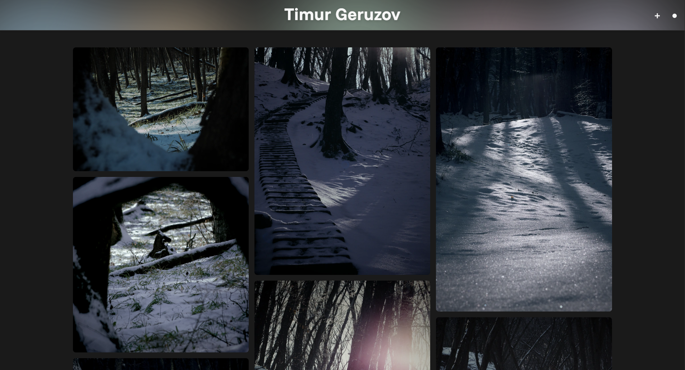
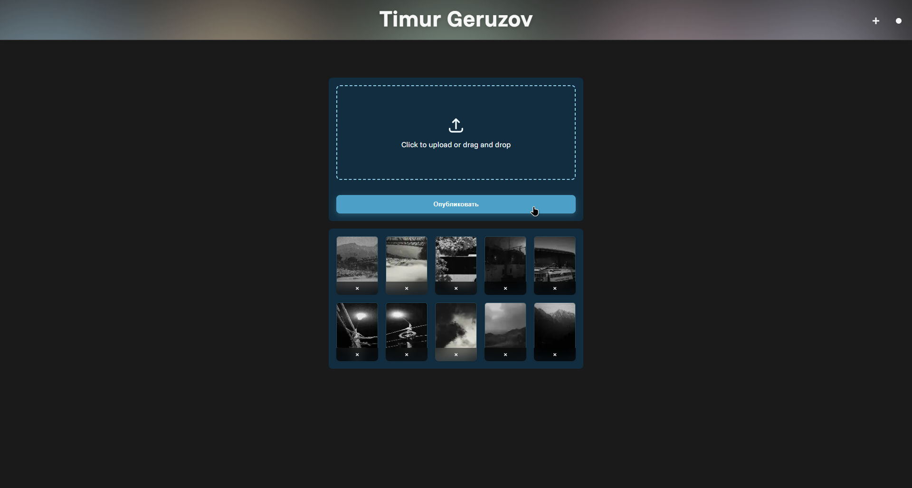

# Django Photo Gallery

[Русская версия](README.ru.md)

[](https://github.com/tgeruzov/django-photo-gallery/actions/workflows/ci.yml)


[](LICENSE)

A personal photo gallery on Django: an infinite-scroll grid, a fullscreen lightbox and a staff-only upload page. Uploaded photos are converted to WEBP thumbnails and optimized full-size versions.

<p align="center">
  
  
  
</p>

## Features

- Masonry grid with keyset pagination and lazy loading
- Lightbox with keyboard and swipe navigation
- Multi-file upload for staff with format, size and duplicate checks (SHA-256)
- Thumbnails and optimized versions generated by Celery, or inline when there is no worker
- SEO: canonical URLs, Open Graph, JSON-LD, sitemap, robots.txt

## How uploads are processed

1. Staff uploads one or more JPEG, PNG or WEBP files.
2. The form checks the extension, file signature and size; duplicates are skipped by content hash.
3. The original is saved, and after commit a task builds a thumbnail (800px) and an optimized version (2560px).
4. The grid shows thumbnails, the lightbox shows optimized versions.

Photos left without variants (a worker crashed, the queue was lost) are picked up by the periodic Celery beat task or by `python manage.py generate_derivatives`.

## Running

### Docker

```bash
cp .env.example .env
docker compose up --build
```

The app is served at http://localhost:8000.

### Local Python

```bash
python -m venv .venv
source .venv/bin/activate      # Windows: .venv\Scripts\activate
cp .env.example .env           # DJANGO_ENV=dev; DB_ENGINE=sqlite if there is no local PostgreSQL
pip install -r requirements.txt
python manage.py migrate
python manage.py createsuperuser
python manage.py runserver
```

Without `DJANGO_ENV` the project starts in `prod` mode and refuses to boot without a strong `SECRET_KEY`.

### Production profile

```bash
docker compose -f docker-compose.prod.yml up --build
```

Services: PostgreSQL, Redis, Django under Gunicorn, a Celery worker with beat, nginx for static and media files, daily `pg_dump` backups. `SECURE_SSL_REDIRECT=0` is set so the profile works over plain HTTP on localhost; enable it behind an HTTPS proxy.

## Routes

| Route | Purpose |
| --- | --- |
| `/` | Gallery |
| `/upload/` | Upload page (staff only) |
| `/all_photos.json` | Paginated JSON API |
| `/admin/` | Django admin |
| `/healthz` | Health check (app and database) |

Example `/all_photos.json` response:

```json
{
  "photos": [
    {
      "id": 1,
      "uploaded_at": "2026-02-25T18:04:12.345678+00:00",
      "url": "/media/thumbnails/2026/02/25/image_thumb.webp",
      "full_url": "/media/optimized/2026/02/25/image_optimized.webp",
      "title": "My photo",
      "alt_text": "My photo",
      "width": 800,
      "height": 533
    }
  ],
  "page": 1,
  "page_size": 200,
  "has_next": true,
  "total": 240
}
```

## Configuration

All variables with comments are listed in [.env.example](.env.example). The main ones:

- App: `DJANGO_ENV`, `DEBUG`, `SECRET_KEY`, `ALLOWED_HOSTS`, `CSRF_TRUSTED_ORIGINS`
- Database: `DB_ENGINE`, `DB_NAME`, `DB_USER`, `DB_PASSWORD`, `DB_HOST`, `DB_PORT`
- Images: `MAX_UPLOAD_SIZE_MB`, `MAX_IMAGE_PIXELS`, `DELETE_ORIGINAL_AFTER_OPTIMIZE`
- Background tasks: `ENABLE_BACKGROUND_TASKS`, `CELERY_BROKER_URL`, `CELERY_RESULT_BACKEND`

## Development

```bash
pip install -r requirements-dev.txt
pre-commit install
pre-commit run --all-files
DJANGO_ENV=test python manage.py test
```

CI (GitHub Actions) runs pre-commit (Ruff), pip-audit, `check --deploy`, migrations and tests on PostgreSQL.

## Production checklist

- `DJANGO_ENV=prod`, `DEBUG=0`
- A strong random `SECRET_KEY` and a non-default `DB_PASSWORD`
- `ALLOWED_HOSTS` and `CSRF_TRUSTED_ORIGINS` for your domain
- HTTPS with `SECURE_SSL_REDIRECT=1`
- Redis and a Celery worker, or `generate_derivatives` on cron
- Backups of `media/` and the database

## License

MIT, see [LICENSE](LICENSE).
