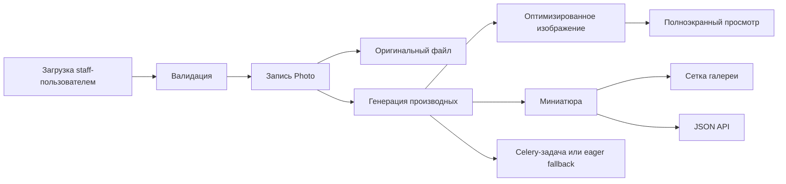

<h1 align="center">Django Photo Gallery</h1>

<p align="center">
  Персональная фотогалерея, которая ощущается прежде всего как пространство для просмотра, а уже потом как админка.
  <br />
  Быстрый просмотр, полноэкранный режим, оптимизированная выдача изображений и Django-бэкенд, который легко развивать дальше.
</p>

<p align="center">
  <a href="README.md">English</a>
  ·
  <a href="README.ru.md"><strong>Русский</strong></a>
</p>

<p align="center">
  <a href="https://tgeruzov.ru/"><strong>Рабочий пример</strong></a>
</p>

<p align="center">
  <a href="https://github.com/tgeruzov/django-photo-gallery/blob/deploy/timeweb-shared/docs/timeweb-deploy.md"><strong>Гайд по деплою на Timeweb shared hosting</strong></a>
</p>

<p align="center">
  <a href="https://github.com/tgeruzov/django-photo-gallery/blob/deploy/timeweb-shared/docs/timeweb-deploy.ru.md"><strong>Гайд по деплою на Timeweb shared hosting (RU)</strong></a>
</p>

<p align="center">
  <a href="https://github.com/tgeruzov/django-photo-gallery/actions/workflows/ci.yml">
    
  </a>
  <a href="https://www.python.org/downloads/release/python-3110/">
    
  </a>
  <a href="https://www.djangoproject.com/">
    
  </a>
  <a href="https://www.postgresql.org/">
    
  </a>
  <a href="LICENSE">
    
  </a>
</p>

<p align="center">
  <a href="#through-the-lens">Через объектив</a>
  ·
  <a href="#darkroom-pipeline">Пайплайн обработки</a>
  ·
  <a href="#choose-your-setup">Варианты запуска</a>
  ·
  <a href="#field-notes">Полевые заметки</a>
  ·
  <a href="#community">Сообщество</a>
</p>

<p align="center">
  
  
  
</p>

<a id="through-the-lens"></a>

## Через объектив

Этот проект построен вокруг самого процесса просмотра фотографий.

- Посетители получают плотную, прокручиваемую галерею с полноэкранным просмотром и удобной навигацией на мобильных.
- Для staff-пользователей есть отдельный сфокусированный сценарий загрузки, а не перегруженная CMS.
- Бэкенд сам генерирует оптимизированные версии и миниатюры, чтобы галерея работала быстро без ручной подготовки ассетов.
- Сам репозиторий подготовлен к долгой жизни: раздельные settings, Docker-сценарии, CI, линтеры и путь к фоновым задачам через Celery.

<table>
  <tr>
    <td width="33%">
      <strong>Для зрителей</strong>
      <br />
      Бесконечная прокрутка, стабильная сетка изображений, полноэкранный lightbox, навигация с клавиатуры и свайпы на мобильных.
    </td>
    <td width="33%">
      <strong>Для поддержки проекта</strong>
      <br />
      Разделённые Django settings, production-like Docker-профиль, путь для Celery worker и общие тома для `media/` и `staticfiles/`.
    </td>
    <td width="33%">
      <strong>Для контрибьюторов</strong>
      <br />
      Pre-commit, Ruff, Black, GitHub Actions и тесты для загрузки, генерации производных изображений и API.
    </td>
  </tr>
</table>

<a id="darkroom-pipeline"></a>

## Пайплайн обработки



Одна и та же фотография проходит через небольшой, но продуманный пайплайн:

1. Staff-пользователь загружает один или несколько файлов.
2. Приложение валидирует формат и размер, затем сохраняет исходное изображение.
3. Генерируются оптимизированная версия и миниатюра.
4. В сетке галереи используются более лёгкие файлы, а для полноэкранного просмотра отдаётся крупная оптимизированная версия.
5. В development это может выполняться eagerly, а в production-like режиме работа может уходить в Celery.

## Чем проект отличается

### Просмотр и есть продукт

Это не универсальная CMS с прикреплёнными картинками. Главная фича здесь именно просмотр, поэтому сетка, lazy loading, lightbox и прогрессивная загрузка так же важны, как и админский сценарий.

### Пайплайн изображений встроен в приложение

Проект не ждёт, что кто-то будет вручную готовить все ассеты. Он сам создаёт нужные версии изображений и умеет догенерировать недостающие производные позже.

### Репозиторий готов к следующему шагу

Проект по-прежнему ощущается как личная галерея, но уже имеет структуру для безопасного развития: отдельные settings, quality gates, документированный production path и поддержку фоновых задач.

<a id="choose-your-setup"></a>

## Варианты запуска

### Самый быстрый старт: Docker

```bash
# Linux / macOS
cp .env.example .env

# Windows PowerShell
Copy-Item .env.example .env

docker compose up --build
```

Открой [http://localhost:8000](http://localhost:8000)

### Локальный запуск через Python

```bash
python -m venv .venv
```

```bash
# Windows
.venv\Scripts\activate

# Linux / macOS
source .venv/bin/activate
```

```bash
pip install -r requirements.txt
python manage.py migrate
python manage.py createsuperuser
python manage.py runserver
```

### Production-like прогон

```bash
docker compose -f docker-compose.prod.yml up --build
```

В этом профиле запускаются:

- Django в режиме `prod`
- Gunicorn как app server
- Redis для брокера и result backend Celery
- отдельный Celery worker
- PostgreSQL для хранения данных
- общие named volumes для `media/` и `staticfiles/`

Для локального smoke test этот профиль держит `SECURE_SSL_REDIRECT=0`, поэтому приложение остаётся доступным по обычному HTTP. За реальным HTTPS-прокси это нужно снова включить.

## Панель маршрутов

| Route | Назначение |
| --- | --- |
| `/` | Главная страница галереи с AJAX-пагинацией |
| `/upload/` | Staff-only страница пакетной загрузки |
| `/all_photos.json` | Пагинированный API галереи |
| `/admin/` | Django admin |

### Пример ответа API

```json
{
  "photos": [
    {
      "id": 1,
      "url": "/media/thumbnails/2026/02/25/image.webp",
      "full_url": "/media/optimized/2026/02/25/image.webp",
      "title": "My photo"
    }
  ],
  "page": 1,
  "page_size": 100,
  "has_next": true,
  "total": 240
}
```

<a id="field-notes"></a>

## Полевые заметки

<details open>
<summary><strong>Ключевые переменные окружения</strong></summary>

- Базовое приложение: `DJANGO_ENV`, `DEBUG`, `SECRET_KEY`, `ALLOWED_HOSTS`, `CSRF_TRUSTED_ORIGINS`, `TIME_ZONE`
- База данных: `DB_NAME`, `DB_USER`, `DB_PASSWORD`, `DB_HOST`, `DB_PORT`, `DB_CONN_MAX_AGE`
- Пайплайн изображений: `MAX_UPLOAD_SIZE_MB`, `MAX_IMAGE_PIXELS`, `MAX_JSON_PAGE_SIZE`, `DELETE_ORIGINAL_AFTER_OPTIMIZE`
- Фоновая обработка: `ENABLE_BACKGROUND_TASKS`, `CELERY_TASK_ALWAYS_EAGER`, `CELERY_BROKER_URL`, `CELERY_RESULT_BACKEND`
- Безопасность продакшена: `SECURE_SSL_REDIRECT`, `SECURE_HSTS_SECONDS`
- Логирование: `LOG_LEVEL`

</details>

<details>
<summary><strong>Проверки качества</strong></summary>

```bash
pip install -r requirements-dev.txt
pre-commit install
pre-commit run --all-files
python manage.py check
python manage.py test
```

GitHub Actions тоже запускает линтинг, миграции и тесты на `push` и `pull_request`.

</details>

<details>
<summary><strong>Карта репозитория</strong></summary>

```text
django-photo-gallery/
├── config/                  # Django config, split settings, Celery wiring
├── docs/                    # README assets
├── gallery/                 # Models, views, services, forms, tests
├── static/                  # CSS, JS, icons
├── .github/workflows/       # CI pipeline
├── docker-compose.yml
├── docker-compose.prod.yml
├── pyproject.toml
├── .pre-commit-config.yaml
├── requirements.txt
├── requirements-dev.txt
└── manage.py
```

</details>

## Чеклист для продакшена

- Установить `DJANGO_ENV=prod`
- Установить `DEBUG=0`
- Использовать сильный случайный `SECRET_KEY`
- Жёстко настроить `ALLOWED_HOSTS`
- Настроить `CSRF_TRUSTED_ORIGINS`
- Выполнить `python manage.py collectstatic --noinput`
- Запустить Redis и Celery worker
- Держать резервные копии `media/`
- Включить HTTPS redirect в реальном продакшене

<a id="community"></a>

## Сообщество

- [Contributing Guide](CONTRIBUTING.md)
- [Security Policy](SECURITY.md)
- [Code of Conduct](CODE_OF_CONDUCT.md)

## Лицензия

Проект распространяется по лицензии MIT. См. [LICENSE](LICENSE).
